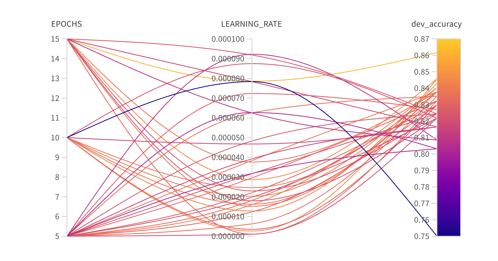
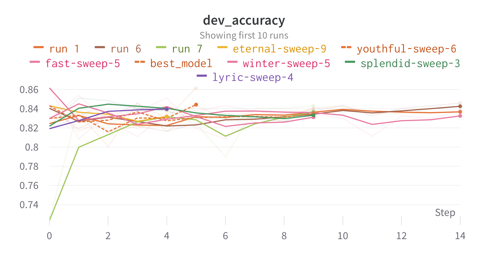

# 
NLP-Sentiment-Analysis

 

  <strong><em>Sentiment Analysis Classifier</em></strong>

By Leopold Herbert-Stevens and Adrien Loizeau

This classifier is designed to perform sentiment analysis on a given dataset. It uses the Hugging Face Transformers library to leverage pre-trained language models for fine-tuning on the sentiment classification task.

Model:
------
The classifier utilizes a pre-trained BERT model ('bert-base-uncased') for sentiment analysis. BERT is a transformer-based model that has shown great success in various NLP tasks. It can be easily replaced with other pre-trained models like 'roberta-base' by changing the 'base_model' parameter during the Classifier object creation.

Input and Feature Representation:
---------------------------------
The input to the classifier consists of sentences, terms, and polarities. Sentences are tokenized using the tokenizer associated with the selected pre-trained model. The tokenizer truncates and pads the sentences to a fixed length of 128 tokens, which are then converted into input IDs and attention masks. The input IDs and attention masks serve as feature representations for the model.

Resources:
----------
The classifier leverages the following resources:

1. Hugging Face Transformers library: A popular library for NLP tasks, it provides pre-trained models and tokenizers for various architectures like BERT and RoBERTa.

2. PyTorch: The classifier uses PyTorch for defining the model, dataset, data loader, optimizer, and loss function.

3. Scikit-learn: The library is used for calculating the accuracy score of the model's predictions.

4. Pandas: Used to read and process the input data.

5. Tqdm: A library to display progress bars during the training and evaluation process.

Workflow:
---------
The workflow is the following:
1. We load the data from the CSV files (train, dev, and test datasets).

2. Tokenize the sentences using the selected pre-trained model's tokenizer (e.g., BERT).

3. Create custom PyTorch datasets (SentimentDataset) and data loaders (DataLoader) for train, dev, and test sets.

4. Fine-tune the pre-trained model on the train dataset using the DataLoader, optimizer, and loss function.

5. Evaluate the model's performance on the dev and test datasets.

6. Calculate and display the accuracy scores for dev and test datasets.

Accuracy on the dev dataset:
----------------------------
To found the best hyperparameters for our model, performed a grid search on many the number of epochs and the learning rate. We found that the best hyperparameters were 15 epochs and a learning rate of 0.000078. The accuracy on the dev dataset was 0.86. The following graph shows the different results for each hyperparameter combination. 

Bellow is the accuracy plot for the best hyperparameters. Our final best model is in red dotted line.

Usage:
------
1. Make sure all required libraries are installed.

2. Set the desired parameters in the 'tester.py' script, such as the number of runs and GPU device ID.

3. Run the 'tester.py' script to train, evaluate, and display the classifier's performance.

Improvements:
-------------
There are several ways th potentially improve the performance of the sentiment analysis classifier:

1. Model architecture: Try other pre-trained models like RoBERTa, DistilBERT, or ALBERT to see if they yield better performance on the sentiment analysis task. To switch models, simply change the 'base_model' parameter during the Classifier object creation.

2. Additional pre-processing: Investigate more advanced pre-processing techniques such as text normalization, stopword removal, and lemmatization to reduce noise in the input data and potentially improve the classifier's performance.

Thank you for reading. 